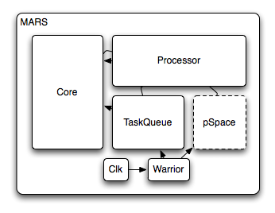

Modules
=======

We have to split the design into modules

   Architecture

* The :doc:`modules/core` alias the **Memory**
* The :doc:`modules/taskqueue` alias the **Scheduler** unit
* The :doc:`modules/proc` alias the **Processing** unit
* The :doc:`modules/pspace` or the Process **private Storage** space
