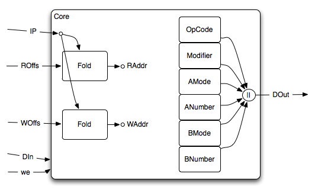

The Core
========

The Core is the main **Memory** were the programs fight
themselves. (As opposed to *each-others*, as nothing prevent you to
hurt yourself.)

As we can see, the Core is split into RAM modules that each of them
store a logical part of the Instructions. there are exactly **6** of
them. One for each part:

#. OpCode
#. Modifier
#. AMode
#. ANumber
#. BMode
#. BNumber

Ports
-----

input
^^^^^

Control Signals
~~~~~~~~~~~~~~~

* pc
* Wofs
* din
* ROfs
* we

Synchronous signals
~~~~~~~~~~~~~~~~~~~

* clk
* rst_n

Parameters
~~~~~~~~~~

* maxSize: the depth of each internal RAM

output
^^^^^^

As every good memory, we only have one output port being the data at
the ``ROfs`` address.

* dout

Sub-processes
-------------

The Core has one main combinatorial subprocess that just split the
incoming Instruction in chuncks for the RAM modules, and join back the
chunks from the RAM modules into one Instruction for the others
:doc:`../modules`.

internal Signals
----------------

Internal signals are only intercommunication signals between the
sub-modules.

Submodules
----------

RAM
^^^

See :doc:`core/ram`.

The basic component of the Core is a RAM with both a read and a write
address bus. This will allow us to make asynchronous read, while
making synchronous write.

Fold
^^^^

See :doc:`core/fold`.

The Fold module just care about the fact that all our Read/Write are
relative to the current Instruction Pointer. The Core itself, through
this module takes offset as Input and translate those Offset as
Absolute Addresses.

