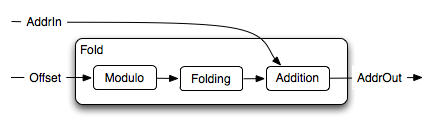

Fold
====

Ports
-----

input
^^^^^

Control ports
~~~~~~~~~~~~~

* PC: The current Program Counter
* Offset

parameters
~~~~~~~~~~

* limit: Folding limit
* maxSize: Size of the :doc:`../core`

output
^^^^^^

* Address

Sub-processes
-------------

This module is composed of three sub-modules:

* Modulo is used to calculate a temporary value
* Folding to Fold the Address into its Read (or Write) boundary.
* Addition to make the Address Absolute. (This step also includes a
  Modulo)

For the two first steps, the Cref provides the following listing:

.. code-block:: c

   /* There is one support function used to limit the range of */
   /* reading from Core and writing to Core relative to the    */
   /* current instruction.  Behaviour is as expected (a small  */
   /* core within Core) only if the limits are factors of the  */
   /* size of Core.                                            */

   static Address Fold(
      Address  pointer,    /* The pointer to fold into the desired range.  */
      Address  limit,      /* The range limit.                             */
      Address  M           /* The size of Core.                            */
   ) {
      Address  result;

      result = pointer % limit;
      if ( result > (limit/2) ) {
         result += M - limit;
      };
      return(result);
   }

Internal Signals
----------------

We have two internal signals to interconnect our three
sub-process. Each one of them representing our output at its different
stage of processing.
