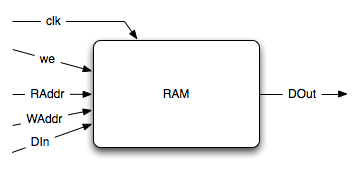

The RAM
=======

Ports
-----

input
^^^^^

Control Signals
~~~~~~~~~~~~~~~

* raddr
* waddr
* din
* we

Synchronisation Signals
~~~~~~~~~~~~~~~~~~~~~~~

* clk
* rst_n (not taken into account in the current implementation)

Parameters
~~~~~~~~~~

* width: the width (in bits) of the RAM
* depth: the depth (in number of cell) of the RAM

output
^^^^^^

Control Signals
~~~~~~~~~~~~~~~

* dout

sub-process
-----------

read
^^^^

Read is completely combinatorial and simply return on ``dout`` the
value of the RAM @ ``raddr``.

write
^^^^^

Write is triggered by the clock, and write ``din`` to the RAM if
``we`` is set.
