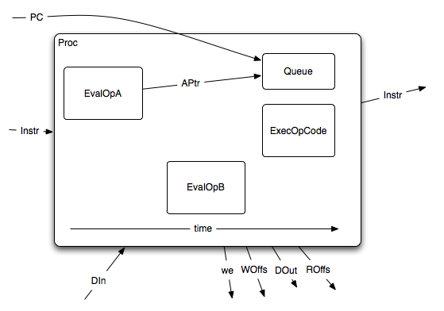
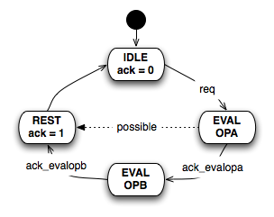

The Proc
========

This is the Processing unit. Its main characteristic is that is has to
be a state-less Module, as no state should subsist between
processes. This same processing unit will be called by each of the
Programs to try destroy each other. Every time, with a new
instruction, and at the end of the processing, everything is done.

Ports
-----

input
^^^^^

Control Signals
~~~~~~~~~~~~~~~

* Instr
* PC
* RData

Synchronous signals
~~~~~~~~~~~~~~~~~~~

* clk
* rst_n

Synchronisation signals
~~~~~~~~~~~~~~~~~~~~~~~

* req

output
^^^^^^

Control Signals
~~~~~~~~~~~~~~~

* IPOut1
* we1
* IPOut2
* we2
* WOfs
* WData
* we
* ROfs

Synchronisation signals
~~~~~~~~~~~~~~~~~~~~~~~

* ack

State-machine
-------------

Sub-processes
-------------

* link is actually just a splitter *à la* VHDL aliases.
* fsm is our FSM.

MUXs
^^^^

the following process are just MUX that dispatch the info acording to the FSM state.

* fsmcore
* updateROfs
* updateIRX
* updatewe
* updatewdata

Sub-modules
-----------

EvalOp
^^^^^^

Evaluate the operand part of the Instruction (Mode + Number). This one
is instanciated twice, once for each of the Operands.

OutQueue
^^^^^^^^

Make the Instruction readable for the :doc:`taskqueue`.

OutCore
^^^^^^^

Make the Instruction readable for the :doc:`core`.
