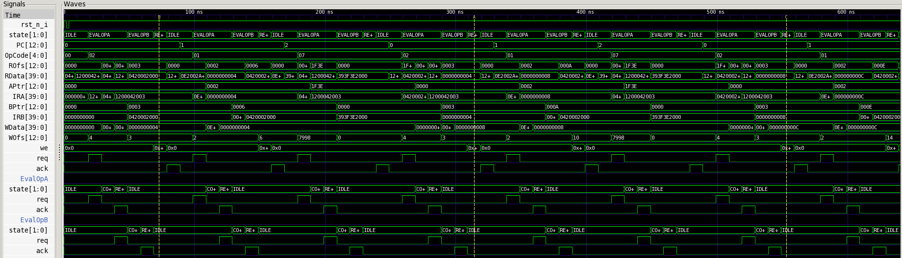

Dwarf
=====

.. code-block:: nasm

   ;redcode
   ;name Dwarf
   ;author A. K. Dewdney
   ;assert CORESIZE % 5 == 0

   	DAT		-1
   	ADD	#5,	-1	; start address
   	MOV	#0,	@-2
   	JMP	-2

Another version put the Bomb after itself

.. code-block:: nasm

   ;redcode
   	ADD	#4,	3
   	MOV	#2,	@2
   	JMP	-2

Here is the result of a simulation on my MARS:

   Dwarf simulation
