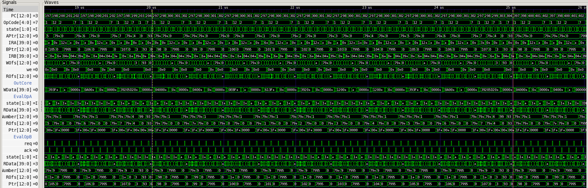

Gemini
======

Code
----

.. code-block:: nasm

   ;redcode
   ;name Gemini
   ;author A. K. Dewdney
   ;assert 1

   	DAT		0
   	DAT		99
   	MOV	@-2,	@-1 ; start address
   	SNE	-3,	#9
   	JMP	4
   	ADD	#1,	-5
   	ADD	#1,	-5
   	JMP	-5
   	MOV	#99,	93
   	JMP	93

Simulation
----------

   Waveforms
